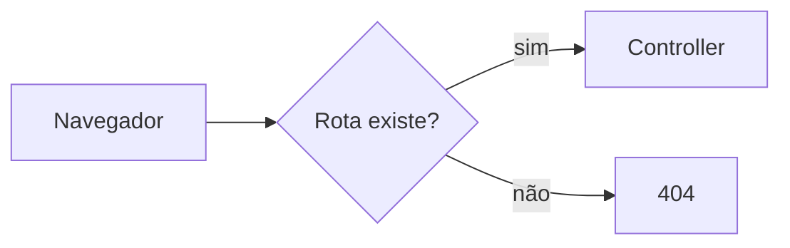
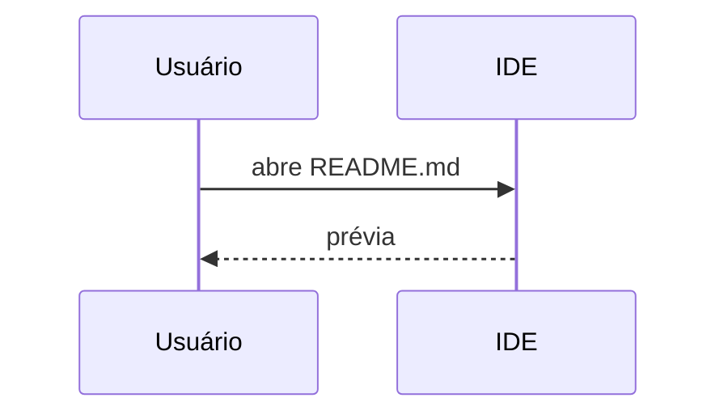

# Diagramas

Fluxo de requisição:


```mermaid
flowchart LR
    A[Navegador] --> B{Rota existe?}
    B -- sim --> C[Controller]
    B -- não --> D[404]
```

Sequência:


```mermaid
sequenceDiagram
    Usuário->>IDE: abre README.md
    IDE-->>Usuário: prévia
```

Código comum:

```php
<?php echo "não é diagrama";
```

Diagrama inválido:

```mermaid
flowchart LR
    A --> 
```
